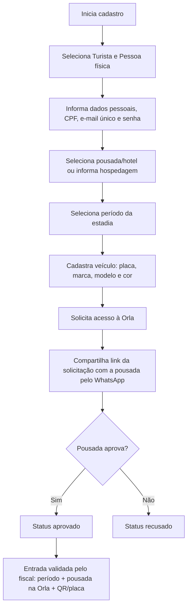
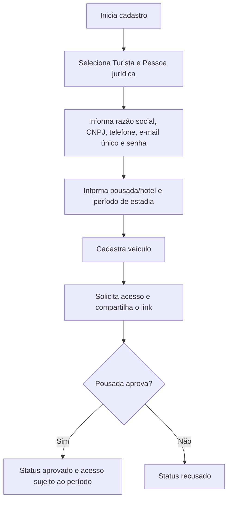
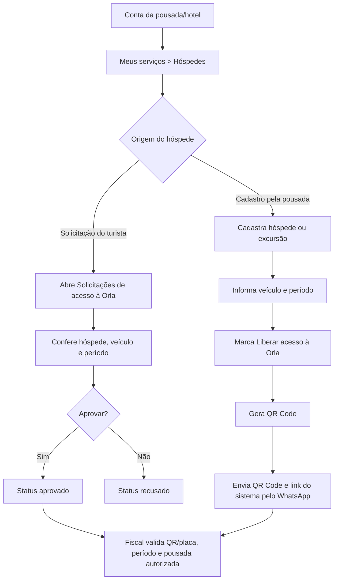

# Fluxos operacionais — Acesso à Orla de Guaibim

Este material registra o fluxo efetivo do MVP. A aprovação da pousada/hotel é obrigatória para turista que seleciona uma hospedagem; a fiscalização ainda valida período da estadia e situação do estabelecimento na área autorizada.

## Turista — pessoa física

## Turista — pessoa jurídica

## Pousada/hotel cadastrando hóspede

Os arquivos para apresentação ficam em `docs/arquivos/fluxos_acesso_orla.pptx` e `docs/arquivos/fluxos_acesso_orla.pdf`. O PowerPoint usa formas editáveis.
